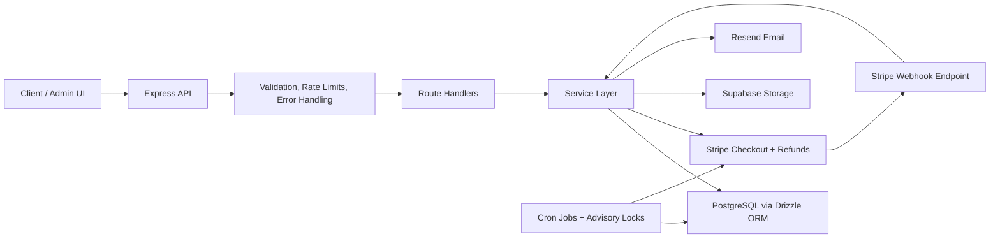

# PopBox Studio Backend

Production-style e-commerce backend built with Node.js, TypeScript, Express, PostgreSQL, and Stripe.

## Overview

This repository contains the backend for PopBox Studio, an e-commerce system designed to demonstrate practical backend architecture rather than a minimal demo API. The codebase focuses on patterns that matter in real systems: typed database access, explicit request validation, structured error responses, inventory reservation during checkout, webhook-driven payment finalization, and background cleanup for expired checkout state.

From an engineering perspective, the project demonstrates:

- Modular service-oriented application structure
- Typed data access with Drizzle ORM
- Checkout idempotency and reservation expiry handling
- Stripe webhook processing with persistence and duplicate protection
- Cursor-based pagination for stable listing endpoints
- Operational safeguards such as rate limits, advisory locks, and graceful shutdown

## Features

- Product catalog with collections, tags, images, and inventory state
- Public product listing and product detail endpoints
- Full-text search and autocomplete for products
- Cursor-based pagination for product, order, and customer listings
- Stripe Checkout session creation with idempotency support
- Inventory reservation during checkout with configurable TTL
- Stripe webhook handling for checkout completion and expiration
- Order creation, payment tracking, shipment tracking, and refunds
- Guest order access flow for viewing orders and tickets
- Admin APIs for products, collections, tags, inventory, kuji prizes, orders, refunds, and shipments
- Background jobs for expired reservations and pending order cleanup
- Zod-based request validation and consistent JSON response envelopes
- Docker image build for containerized deployment

## Architecture

At a high level, the backend is organized around route handlers, service modules, a typed database layer, and scheduled background jobs.

- API routes under `src/routes` define the HTTP surface and apply validation/middleware.
- Service modules under `src/services` contain business logic for catalog, checkout, orders, admin operations, notifications, and webhooks.
- The database layer under `src/db` defines the PostgreSQL schema and exposes Drizzle clients for typed queries and transactions.
- Background jobs under `src/jobs` use cron scheduling plus PostgreSQL advisory locks to safely process cleanup work.
- Stripe integration is split between checkout session creation and webhook-driven state transitions.



## Tech Stack

| Technology | Purpose |
|------------|---------|
| Node.js | Application runtime |
| TypeScript | Static typing across the application |
| Express | HTTP server and routing |
| PostgreSQL | Primary relational data store |
| Drizzle ORM | Typed SQL queries, schema definitions, and transactions |
| Zod | Request validation |
| Stripe | Checkout sessions, payment events, and refunds |
| Supabase Storage | Product image storage |
| Resend | Shipment notification email delivery |
| node-cron | Scheduled background jobs |
| Pino | Structured application and HTTP logging |
| Docker | Containerized build and runtime |
| pnpm | Package management |

## Database Design

The schema is centered around a few core domains:

- Catalog: `products` belong to optional `collections`, can have many `tags`, many `product_images`, and one `product_inventory` record.
- Inventory and reservation state: inventory is stored separately from product metadata so stock operations can be managed independently. `inventory_reservations` tracks quantities held during checkout before payment is completed.
- Customers and orders: `customers` and `addresses` capture buyer information, while `orders` store status, totals, Stripe references, guest access state, and address snapshots taken at checkout time.
- Order composition and payments: `order_items` preserve the purchased product snapshot, `payments` track provider payment state, and `payment_refunds` track refund history and reconciliation state.
- Fulfillment: `shipments` stores carrier and tracking information for shipped orders.
- Kuji flow: `kuji_prizes` defines prize inventory for kuji products, and `tickets` links purchased order items to awarded prizes and reveal state.
- Operational events: `stripe_webhook_events` records webhook payloads and processing status for idempotent payment event handling.

Conceptually, the design separates mutable operational state such as inventory, reservations, payment state, and shipment state from relatively stable catalog data. That keeps inventory-sensitive flows explicit and easier to reason about.

## Key System Flows

### Product Browsing

1. A client requests products, collections, tags, home data, or search endpoints under `/api/v1`.
2. Query parameters are validated with Zod before any business logic runs.
3. Product services query PostgreSQL through Drizzle, apply filters and sort order, and use cursor-based pagination where relevant.
4. Related data such as images, collection info, tags, inventory, and kuji prizes is assembled into API response models.

### Checkout Session Creation

1. The client sends `POST /api/v1/checkout/session` with cart items, customer details, and an `Idempotency-Key` header.
2. The service validates the request, normalizes items, and checks shipping and billing address constraints.
3. Inside a transaction, each product row is locked, inventory availability is checked, an order is created, order items are inserted, and inventory reservations are written.
4. Reserved quantities are incremented in `product_inventory`.
5. A pending payment record is created.
6. After the transaction commits, a Stripe Checkout Session is created with order metadata.
7. The order is updated with Stripe identifiers and the checkout URL is returned.
8. If the same idempotency key is reused, the existing open checkout session is returned instead of creating a duplicate order.

### Inventory Reservation

1. Checkout creation writes `inventory_reservations` with an expiration timestamp derived from the configured reservation TTL.
2. Reserved inventory is tracked separately from on-hand inventory.
3. Availability checks use `on_hand - reserved`, preventing overselling during concurrent checkout attempts.

### Stripe Payment Confirmation

1. Stripe sends events to `POST /api/v1/webhooks/stripe`.
2. The raw request body is verified against the Stripe webhook signature.
3. The event is persisted to `stripe_webhook_events`, and an advisory lock is used to avoid duplicate concurrent processing.
4. Successful checkout events finalize the order and payment state.
5. Expired checkout events release reservations and transition the order to `expired` when applicable.

### Reservation Expiration and Cleanup Jobs

1. Scheduled jobs run on a cron schedule at application startup.
2. Jobs acquire PostgreSQL advisory locks so only one worker processes a job batch at a time.
3. Expired pending orders are marked `expired`, reservations are released, and open Stripe sessions are proactively expired when possible.
4. A separate cleanup pass processes orders already marked `expired` and releases any remaining active reservations.
5. Job execution is logged with duration and outcome for operational visibility.

## Local Development Setup

### Prerequisites

- Node.js 22+
- pnpm
- PostgreSQL
- Stripe test credentials
- Supabase project credentials for storage access

### Install dependencies

```bash
pnpm install
```

### Configure environment variables

Create a local `.env` file with the required configuration. The application validates these at startup.

Required variables include:

- `PORT`
- `CORS_ORIGIN`
- `CLIENT_BASE_URL`
- `ADMIN_BASE_URL` (optional if it should default to `CLIENT_BASE_URL/admin`)
- `API_BASE_URL`
- `DATABASE_URL`
- `SUPABASE_URL`
- `SUPABASE_PUBLIC_KEY`
- `SUPABASE_SECRET_KEY`
- `SUPABASE_STORAGE_BUCKET`
- `STRIPE_SECRET_KEY`
- `STRIPE_WEBHOOK_SECRET`
- `STRIPE_SHIPPING_RATE_CENTS`
- `STRIPE_SUCCESS_URL`
- `STRIPE_CANCEL_URL`
- `STRIPE_CHECK_SESSION_RESERVATION_TTL`
- `RESEND_API_KEY`
- `RESEND_FROM_EMAIL`
- `ORDER_TOKEN_PEPPER`

### Run the development server

```bash
pnpm dev
```

The API starts on `0.0.0.0:$PORT`. A health check is available at `GET /health`.

### Build and run production output

```bash
pnpm build
pnpm start
```

### Run with Docker

This repository includes a production `Dockerfile`.

```bash
docker build -t popbox-studio-node .
docker run --env-file .env -p 3000:3000 popbox-studio-node
```

Note: a `docker-compose.yml` file is not included in this repository, so `docker compose up --build` is not documented here as a supported local workflow.

## Project Structure

```text
src/
  config/
  constants/
  db/
  integrations/
  jobs/
  middleware/
  routes/
  schemas/
  services/
  types/
  utils/
supabase/
  migrations/
Dockerfile
drizzle.config.ts
package.json
```

- `src/config`: environment loading and configuration validation
- `src/constants`: shared enums and application constants
- `src/db`: Drizzle database client and PostgreSQL schema definitions
- `src/integrations`: external service clients such as Stripe, Supabase, and Resend
- `src/jobs`: scheduled background jobs and advisory lock helpers
- `src/middleware`: request validation, auth, rate limiting, not found handling, and exception handling
- `src/routes`: versioned Express routers for public, admin, checkout, orders, and webhooks
- `src/schemas`: Zod schemas for request params, query strings, and bodies
- `src/services`: business logic modules separated by domain
- `src/types`: shared TypeScript types for domain models and Express extensions
- `src/utils`: cursors, crypto helpers, logging, guest access utilities, and shared helpers
- `supabase/migrations`: SQL migrations for the PostgreSQL schema

## Design Decisions

### Drizzle for typed SQL

Drizzle provides strongly typed schema definitions and query building while still allowing direct SQL where that is the clearest option. This is useful in a backend that mixes straightforward CRUD with inventory-sensitive transactional logic and search queries.

### Cursor-based pagination

Product, order, and customer listings use cursor-based pagination instead of offset pagination. That avoids unstable paging under concurrent writes and scales better for large datasets where deep offsets become expensive.

### Inventory separate from product metadata

Inventory is modeled in `product_inventory` instead of embedding stock fields directly on `products`. This keeps stock mutation paths explicit and supports reservation accounting without coupling inventory concerns to the catalog record itself.

### Reservation TTL plus cleanup jobs

Checkout creates temporary reservations so inventory is held while the customer completes Stripe Checkout. Background jobs release expired reservations and expire stale pending orders, which reduces inventory leakage and keeps catalog availability accurate.

### Webhook-driven payment finalization

Stripe is treated as the source of truth for payment completion. Checkout session creation initiates payment, but order finalization is handled via verified webhooks, which is more reliable than relying on client-side redirects alone.

### Advisory locks for concurrency control

The code uses PostgreSQL advisory locks in jobs and order actions to prevent duplicate processing across workers. This is a pragmatic approach for production-style coordination without introducing a separate distributed locking system.

### Structured API responses and validation

Zod validation runs at the route boundary, and the application returns consistent JSON envelopes through a shared response interceptor. This keeps error handling predictable for API consumers and reduces validation drift across endpoints.

## Future Improvements

- Add a queue-backed worker model for asynchronous jobs and webhook retries
- Introduce caching for high-read catalog endpoints and search suggestions
- Improve search ranking with richer weighting and analytics feedback
- Add automated integration tests around checkout, webhook handling, and refunds
- Expand observability with metrics, tracing, and job dashboards
- Add explicit inventory audit trails for manual adjustments and reconciliation
