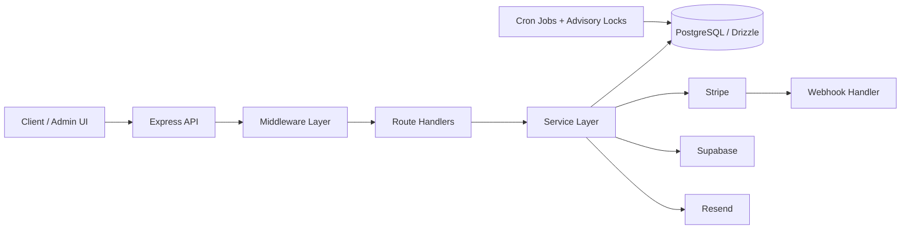

# PopBox Studio Backend

**Production-grade Express 5 + TypeScript REST API** for PopBox Studio—an anime merchandise storefront with **standard and Ichiban Kuji** products. The service is the **system of record** for catalog, inventory, checkout, **Stripe Checkout + webhooks**, orders, guest access, Kuji tickets and reveals, admin operations, transactional email, and published legal/FAQ content.

## Why this project matters

This backend demonstrates production-grade system design across payment processing, inventory consistency, secure session handling, and domain-specific commerce logic (Ichiban Kuji). It reflects real-world backend concerns such as idempotency, concurrency control, webhook-driven state transitions, and strict API contract ownership.

## Highlights

- **Versioned REST surface** at `/api/v1` with a shared response envelope, Zod validation at the boundary, and centralized error handling.
- **Stripe webhook as source of truth** for payment completion; raw-body signature verification and persisted event handling for idempotency and safe retries.
- **Inventory reservations** — Checkout creates reservations with a fixed 10-minute TTL; background jobs release stale reservations and coordinate with Stripe session expiry.
- **Guest order access**: bootstrap flows establish an **HttpOnly cookie** session; sensitive rules and token handling stay on the server.
- **Kuji-aware domain logic**: prize inventory, ticket lifecycle, and reveal semantics (including operational safeguards around unrevealed data and edge cases such as **Last One** handling where modeled).
- **OpenAPI 3.1** in `openapi.yml` documents the HTTP contract for storefront and admin consumers.
- **Middleware + service layer**: routes stay thin; business rules live in `src/services` with Drizzle/Postgres transactions for consistency-critical paths.
- **Supabase-backed stack**: Postgres (via `DATABASE_URL`), Auth JWT verification for admin (`jose` + JWKS), and Storage for catalog assets.
- **Operational hardening**: rate limits, structured logging (Pino), advisory locks for jobs/webhook coordination, and graceful shutdown hooks.

## Overview

This repository is the **authoritative backend** for PopBox Studio. A separate **Next.js** frontend is a **consumer only**: it must not duplicate inventory, payment, order, or Kuji rules.

The API owns **validation, persistence, and workflows** end to end, including payment state, inventory integrity, and order lifecycle management: money as **integer cents**, Canada-only shipping for the current product scope, order lifecycle transitions, refunds and shipments, notifications, and admin/catalog tooling. Public routes live under `/api/v1/...`; admin routes under `/api/v1/admin/...`; Stripe under `/api/v1/webhooks/stripe`.

## Tech Stack

| Area | Choices |
|------|---------|
| Runtime / HTTP | Node.js **22**, **Express 5**, TypeScript (**strict** `tsconfig`, `exactOptionalPropertyTypes`, `noUncheckedIndexedAccess`) |
| Data | **PostgreSQL**, **Drizzle ORM**, `postgres` driver; schema in `src/db`, migrations emitted under `supabase/migrations` (Drizzle Kit) |
| Platform | **Supabase** (Postgres URL, Auth JWKS verification, Storage bucket for images) |
| Payments / email | **Stripe** Checkout, webhooks, refunds; **Resend** for transactional mail |
| Validation / API | **Zod** (+ `drizzle-zod` where used), consistent JSON envelopes, `openapi.yml` |
| Cross-cutting | **Helmet**, **CORS**, **compression**, **express-rate-limit**, **Pino** / **pino-http** |
| Tooling | **pnpm**, **ESLint**, **TypeScript**, **Vitest** + **supertest**, **Docker** (multi-stage `Dockerfile`) |

## Features

### Customer / order-facing

- Product discovery: collections, tags, images, home payloads, **Postgres FTS + trigram** search and suggestions, **cursor-based pagination** on list endpoints.
- **Stripe Checkout session** creation with required **`Idempotency-Key`**, shipping restricted to **Canada**, and order/address snapshots at purchase time.
- **Inventory reservations** during checkout; availability derived from on-hand minus reserved quantities under row locking.
- Order history, detail, and **guest order access** via server-managed session after bootstrap.
- **Kuji**: ticket records tied to order lines, prize allocation on successful payment, **reveal** flows designed for **idempotency**; unrevealed responses avoid leaking prize details.
- Published **legal documents** and **FAQ** for the storefront.

### System / operational

- **Stripe webhook** ingestion with signature verification on the **raw body**, persistence for deduplication, and guarded processing (e.g. advisory locks) for concurrency safety.
- **Cron-scheduled jobs** for reservation expiry, pending-order cleanup, and related maintenance using **Postgres advisory locks** so multiple workers do not double-process.
- Structured logging and health reporting via **`GET /health`** (process + DB connectivity).
- **Graceful shutdown**: stop accepting traffic, drain in-flight work, stop jobs, close DB pool.

### Admin / business

- Supabase **JWT-verified** admin APIs for catalog (products, collections, tags, images, inventory), **Kuji prizes**, orders (status, shipments, refunds, operational emails), customers, and **legal/FAQ CMS-style** management (draft/publish patterns as implemented).

## Architecture Overview

| Layer | Responsibility |
|-------|----------------|
| **Routes** (`src/routes`) | Versioned routers (`/api/v1`, `/api/v1/admin`, webhooks); compose middleware; map HTTP to service calls. |
| **Middleware** (`src/middleware`) | Auth (admin JWT), validation, rate limits, security headers, not-found and **centralized exception → response** mapping. |
| **Schemas** (`src/schemas`) | Zod models for params, query, and body; shared with handlers and reflected in OpenAPI where applicable. |
| **Services** (`src/services`) | Domain logic: catalog, checkout, orders, webhooks, notifications, legal, admin workflows, etc. |
| **DB** (`src/db`) | Drizzle schema, queries, and transactions; enums and invariants for orders, payments, inventory, Kuji, and webhooks. |
| **Integrations** (`src/integrations`) | Stripe, Supabase, Resend clients—kept at the edge of services. |
| **Jobs** (`src/jobs`) | Scheduled tasks and lock helpers for background maintenance. |
| **Config / utils** (`src/config`, `src/utils`, `src/constants`, `src/types`) | Env validation at startup, logging, crypto/guest helpers, cursors, shared types. |

HTTP handlers stay thin; **consistency-sensitive paths** use explicit transactions and locking. Webhooks and jobs follow the same service/DB patterns as synchronous routes.

## System overview



## Key Engineering Decisions

- **Webhook-first payment finalization**: redirect URLs are UX hints; **verified Stripe events** drive order/payment state transitions, refunds, and inventory/Kuji side effects.
- **Idempotency as a first-class concern** — Checkout, webhook handling, and critical mutations are designed to be safely retried without duplicating side effects.
- **Backend owns business rules**: the frontend binds to this API contract and must not re-implement stock, pricing, Kuji, or order invariants.
- **Guest security model**: short-lived or emailed bootstrap mechanics feed into an **HttpOnly cookie session** for ongoing order access instead of passing long-lived secrets on every request.
- **Contract discipline**: `openapi.yml` is the **documented HTTP contract**; implementation and Zod schemas in-repo are the behavioral source of truth—keep them aligned on changes.
- **Validation and errors at the edge**: Zod validates before services run; a **single error/response shape** keeps admin and storefront clients predictable.
- **Inventory and money integrity**: integer cents, explicit reservation accounting, and transactional checkout paths reduce race and oversell risk; **problem payments** can land in states such as **`paid_needs_attention`** when the system cannot finalize safely.
- **Concurrency without extra infrastructure**: **Postgres advisory locks** serialize sensitive webhook and job batches across processes.
- **Pagination stability**: cursors instead of deep offsets for large, mutating lists.

## Key Flows

1. **Checkout**: `POST /api/v1/checkout/session` (+ `Idempotency-Key`) → validate cart/addresses → transaction locks inventory rows, creates order + items, writes reservations, creates pending payment → Stripe Checkout Session → return URL; repeats with the same key return the existing open session.
2. **Payment**: Stripe → `POST /api/v1/webhooks/stripe` (raw body) → verify signature → persist event → finalize or expire order path, release reservations when appropriate, run Kuji allocation when paid.
3. **Guest orders**: bootstrap endpoint establishes server-side guest session (cookie); subsequent order reads use that session, not client-trusted identity flags.
4. **Kuji**: paid orders materialize tickets; **reveal** endpoints update reveal state **idempotently**; list/detail shapes respect unrevealed vs revealed semantics.
5. **Admin operations**: JWT proves Supabase-authenticated admin; mutating routes update order status, shipments, refunds, and resend operational communications per service rules.

## Getting Started

**Prerequisites:** Node.js **22+**, **pnpm**, PostgreSQL (typically Supabase), Stripe test keys, Supabase project (DB + Auth + Storage).

```bash
pnpm install
```

Create a `.env` file (variables validated at startup—see below). Apply the SQL in `supabase/migrations/init.sql` where required for auth sync, Kuji/search triggers, and related DB objects.

```bash
pnpm dev          # ts-node-dev → src/index.ts, listens on 0.0.0.0:$PORT (default 3000)
pnpm build        # tsc → dist/
pnpm build:prod   # build + upload backend sourcemaps to Sentry
pnpm start        # node dist/index.js
pnpm check        # typecheck + eslint
pnpm test:launch  # build + Vitest launch/safety suite (see tests/launch)
```

**Docker** (multi-stage image exposes **3000**):

```bash
docker build -t popbox-studio-node .
docker run --env-file .env -p 3000:3000 popbox-studio-node
```

`docker-compose.yml` is not part of this repo.

## Environment Variables

| Variable | Role |
|----------|------|
| `PORT` | HTTP port (default **3000** if unset/invalid). |
| `NODE_ENV` | Runtime mode (default `dev` in config). |
| `LOG_LEVEL` | Pino log level (default `info`). |
| `CORS_ORIGIN` | Allowed browser origin URL. |
| `CLIENT_BASE_URL` | Public storefront base URL (trailing slashes normalized). |
| `ADMIN_BASE_URL` | Admin UI base URL; defaults to `{CLIENT_BASE_URL}/admin` if omitted. |
| `DATABASE_URL` | `postgres://` or `postgresql://` connection string. |
| `SUPABASE_URL` | Supabase project URL. |
| `SUPABASE_PUBLIC_KEY` | Supabase anon/public key (JWKS verification uses `${SUPABASE_URL}/auth/v1`). |
| `SUPABASE_SECRET_KEY` | Supabase service role key for server-side Storage/API usage. |
| `SUPABASE_STORAGE_BUCKET` | Bucket name for product images. |
| `STRIPE_SECRET_KEY` | Stripe secret API key. |
| `STRIPE_WEBHOOK_SECRET` | Stripe signing secret for webhook verification. |
| `STRIPE_SHIPPING_RATE_CENTS` | Flat shipping amount in cents (default **1500** if unset). |
| `STRIPE_SUCCESS_URL` / `STRIPE_CANCEL_URL` | Stripe Checkout return URLs. |
| `STRIPE_CHECK_SESSION_RESERVATION_TTL` | Must be **`600000`** (10 minutes) milliseconds if set; omitted uses the same default. |
| `RESEND_API_KEY` | Resend API key. |
| `RESEND_FROM_EMAIL` | From address for outbound mail. |
| `ORDER_NOTIFICATION_EMAIL` | Destination for order notifications. |
| `CONTACT_EMAIL` | Contact address used by the system. |
| `ORDER_TOKEN_PEPPER` | Server secret mixed into guest/order token hashing (never store raw guest secrets). |
| `SENTRY_DSN` | Backend Sentry DSN for runtime error capture in production. |
| `SENTRY_ENVIRONMENT` | Sentry environment tag; defaults to `NODE_ENV` if omitted by the SDK config. |
| `SENTRY_RELEASE` | Release identifier shared between runtime events and sourcemap uploads. |
| `SENTRY_AUTH_TOKEN` | Build/deploy-only Sentry auth token for sourcemap upload. Not required for local `pnpm build`. |
| `SENTRY_ORG` / `SENTRY_PROJECT` | Build/deploy-only Sentry org/project used by `pnpm sentry:sourcemaps`. |

## Sentry

- Runtime capture is backend-only and leaves the existing Express exception middleware in control of API response envelopes.
- `pnpm build` stays local/CI-safe and does not upload sourcemaps.
- `pnpm build:prod` is the deploy-time path when production artifacts should also upload Sentry sourcemaps.
- Request sanitization is intentionally narrow: query values for `token`, `session_id`, and `checkout_session_id`, plus headers `authorization`, `cookie`, `set-cookie`, and `x-order-token`.

## API Overview

- **Base path:** `/api/v1` for public resources; `/api/v1/admin` for authenticated admin tools; **`GET /health`** is unversioned.
- **Contract:** `openapi.yml` (OpenAPI **3.1**) describes paths, envelopes, and schemas; regenerate or update it when changing externally visible behavior.
- **Domains covered** (non-exhaustive): home/catalog, search, checkout, orders, guest flows, legal/FAQ, Stripe webhooks, and admin surfaces for catalog, orders, customers, and content.

## Folder Structure

```text
src/
  config/        # Env loading + startup validation
  constants/     # Shared enums/constants
  db/            # Drizzle client + schema
  integrations/  # Stripe, Supabase, Resend clients
  jobs/          # Cron tasks + locking helpers
  middleware/    # Auth, validation, limits, errors
  routes/        # Express routers (v1 public/admin/webhooks)
  schemas/       # Zod request models
  services/      # Domain logic
  types/         # Shared TS types / Express augmentations
  utils/         # Logging, crypto, cursors, helpers
supabase/
  migrations/    # SQL migrations (incl. Drizzle-generated + init schema)
openapi.yml      # HTTP API contract
Dockerfile
drizzle.config.ts
package.json
```

## Quality, Testing, and CI

- **Local checks:** `pnpm check` runs **`tsc --noEmit`** and **ESLint** on `src/`.
- **Tests:** `pnpm test:launch` compiles then runs **Vitest** scenarios under `tests/launch` (checkout, webhooks, guest access, jobs/TTL, env bootstrap, order safety).
- **CI:** GitHub Actions (`.github/workflows/ci.yml`) on pushes/PRs to configured branches runs `pnpm install --frozen-lockfile`, `pnpm check`, and `pnpm test:launch` on **Node 22**.
- **API contract:** treat **`openapi.yml`** as the consumer-facing contract; keep it accurate when endpoints or envelopes change.

## Roadmap / Future Improvements

- Queue-backed workers for webhooks and long-running cleanup instead of in-process cron only.
- Deeper automated integration coverage for refunds, admin mutations, and Kuji edge cases.
- Read-model caching for hot catalog paths where profiling justifies it.
- Richer search ranking and observability (metrics/tracing) as traffic grows.
- Explicit inventory audit trails for manual adjustments and reconciliation.

## License

ISC
